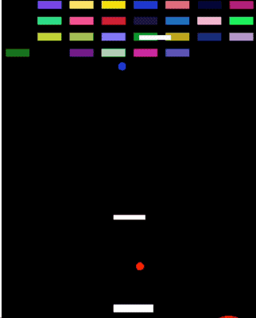
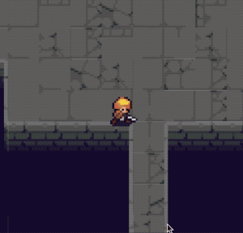
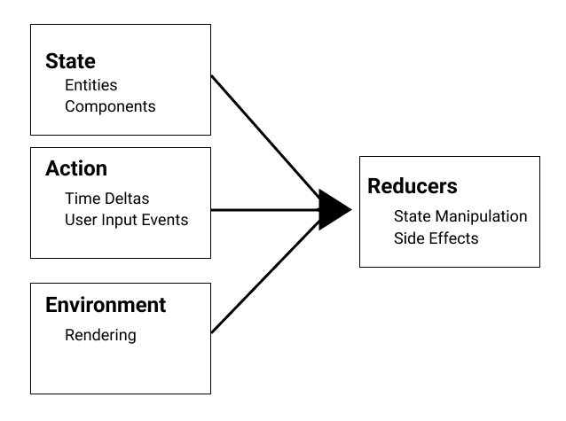

# RedECS

A Swift Entity Component System. Inspired by The Composable Architecture and focused on cross-platform.

## Current Supported Platforms

- iOS, tvOS, macOS
- Web

### Note: This is still under heavy development so documentation is sparse

## Features
- Highly modular Entity Component System
- Fully `Codable` game state
- Separation of State and Game Logic through composable reducers.
- Cross-platform, trying to have equivalents for all SpriteKit/GameplayKit capabilities (within reason)

## Who is this Game Engine for?
- People who love Swift, first and foremost. There are a lot of options out there with far more advanced capabilities, so if you don't love Swift, you may not see a point
- Hobby Game developers, at least while this is under development for a while
- People who want to publish fun little things written in Swift to all platforms. The engine is likely to prioritize cross compatibility over performance or depth of capabilities.
- People looking for a Swift game engine to tinker with, contribute to, help measure, build and turn this into something that maybe changes who this game engine is for entirely. How meta.

## Tutorials
- [Getting Started](getting-started.md)

## Architecture

The engine's architecture is highly inspired by The Composable Architecture, but a gaming-focused flavour.

## Roadmap Ideas (unprioritized)

- Review best capabilities of SpriteKit and Cocos2D-iPhone and determine what this engine should provide
- Develop more components/reducers and algorithms to match GameplayKit capabilities and other common gaming problems
- Investigate Windows support
- CLI tooling
 - Significantly improve resource management
 - CodeGen to reduce boilerplate, help with templates
- GUI Editor
