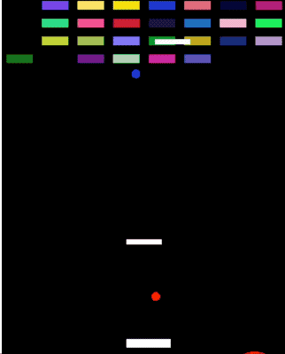
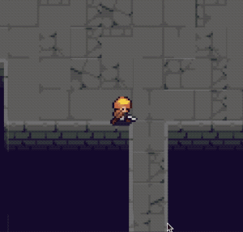
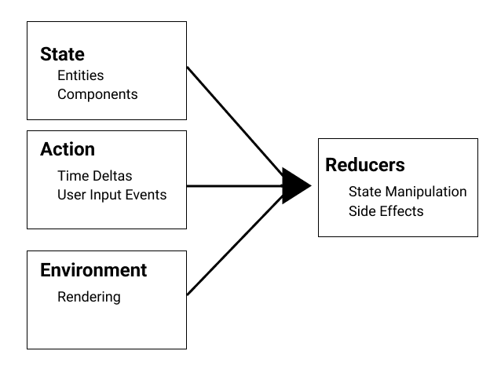

# RedECS

A Swift Entity Component System. Inspired by The Composable Architecture and focused on cross-platform.





## Current Supported Platforms

- iOS 16+, tvOS 16+, macOS 13+ (Metal renderer)
- Web via WebAssembly (WebGL renderer)

## Requirements

- Swift 6.2+ (all targets build in the Swift 6 language mode)

### Building & Testing

```console
swift build
swift test
```

Note: rendering tests compile the Metal shaders and load textures from
loose files at runtime when run from the command line; running through
Xcode uses the compiled shader library and asset catalog instead. Both work.

### Building for the Web

Install the [Swift SDK for WebAssembly](https://book.swiftwasm.org/getting-started/setup.html)
and the exactly-matching [swift.org toolchain](https://www.swift.org/install/)
(the wasm SDK requires the same compiler version it was built with), then:

```console
swift build --swift-sdk 6.2-RELEASE-wasm32-unknown-wasip1 --target RedECSWebSupport
```

(The `RedECSAppleSupport` target cannot build for wasm, so build the web
product/target specifically rather than the whole package.)

## Features
- Highly modular Entity Component System
- Fully `Codable` game state
- Entity parent/child hierarchy: children render through their ancestors'
  composed transforms, and hiding an entity hides its subtree
- Separation of State and Game Logic through composable reducers.
- Cross-platform, trying to have equivalents for all SpriteKit/GameplayKit capabilities (within reason)

## Who is this Game Engine for?
- People who love Swift, first and foremost. There are a lot of options out there with far more advanced capabilities, so if you don't love Swift, you may not see a point
- Hobby Game developers, at least while this is under development for a while
- People who want to publish fun little things written in Swift to all platforms. The engine is likely to prioritize cross compatibility over performance or depth of capabilities.
- People looking for a Swift game engine to tinker with, contribute to, help measure, build and turn this into something that maybe changes who this game engine is for entirely. How meta.

## Tutorials
- [Getting Started](getting-started.md)
- [Starter Template](https://github.com/RedECSEngine/starter-template)

## Example Projects
- [Asteroids](https://github.com/RedECSEngine/RedECS-Asteroids)
- [Breakout](https://github.com/RedECSEngine/RedECS-Breakout)
- [RPG web demo](https://github.com/RedECSEngine/rpg-demo-web)

## Architecture

The engine's architecture is highly inspired by The Composable Architecture, but a gaming-focused flavour.




## Roadmap Ideas (unprioritized)

- Review best capabilities of SpriteKit and Cocos2D-iPhone and determine what this engine should provide
- Develop more components/reducers and algorithms to match GameplayKit capabilities and other common gaming problems
- Investigate Windows support
- CLI tooling
 - Significantly improve resource management
 - CodeGen to reduce boilerplate, help with templates
- GUI Editor
